<h1 align="center">Escape your boss</h1>

<p align="center">
  <b>Il est 18:00. Ton travail est fini. Ton sac est prêt.</b><br>
  Entre toi et l'ascenseur : un open space, des collègues qui ont toujours
  « une petite question »,<br>et un directeur qui adore les réunions de
  « juste cinq minutes ».
</p>

<p align="center">
  <a href="https://github.com/SoLeQz/EscapeYourBoss/releases/latest">
    
  </a>
</p>

<p align="center">
  
  
  
  
</p>

<p align="center">
  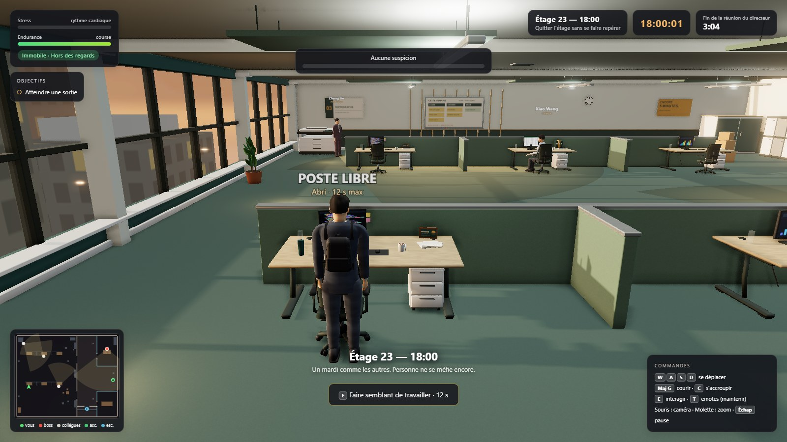
</p>

**Escape your boss** est un jeu d'infiltration humoristique en 3D. Tu incarnes
**Lao D**, développeur chez Méridien (*Conseil · Stratégie · Café*), et ta seule
mission est de **quitter le bureau à l'heure**. Faufile-toi derrière les
cloisons, fais semblant de travailler quand un regard se pose sur toi, lance la
photocopieuse pour détourner l'attention… et file avant la fin de la réunion du
directeur.

Premier volet de la série **Escape…**

---

## Télécharger et jouer

1. Va sur la **[page des versions](https://github.com/SoLeQz/EscapeYourBoss/releases/latest)**
   et télécharge `EscapeYourBoss-<version>-win64.zip` (≈ 125 Mo).
2. **Dézippe** le dossier où tu veux (bureau, `Documents`, clé USB…).
3. Double-clique sur **`EscapeYourBoss.exe`**. C'est tout : rien à installer.

> **Windows affiche « Windows a protégé votre ordinateur » ?**
> Le jeu n'est pas signé numériquement (ça coûte cher pour un projet perso).
> Clique sur **Informations complémentaires** puis **Exécuter quand même**.

| | Configuration |
|---|---|
| **Système** | Windows 10 ou 11, 64 bits |
| **Carte graphique** | dédiée conseillée ; un GPU intégré fonctionne, avec des effets allégés |
| **Espace disque** | ≈ 300 Mo une fois dézippé |
| **Contrôles** | clavier + souris (ZQSD en AZERTY sans rien régler) |

Le jeu détecte ta carte graphique au lancement et règle la qualité tout seul.
Sur un portable à deux GPU, il réclame la carte dédiée. Pas de réglage à
chercher, pas de version navigateur : c'est ce qui permet des textures plus fines
et des ombres plus nettes.

---

## Ce qui t'attend

<table>
  <tr>
    <td width="50%">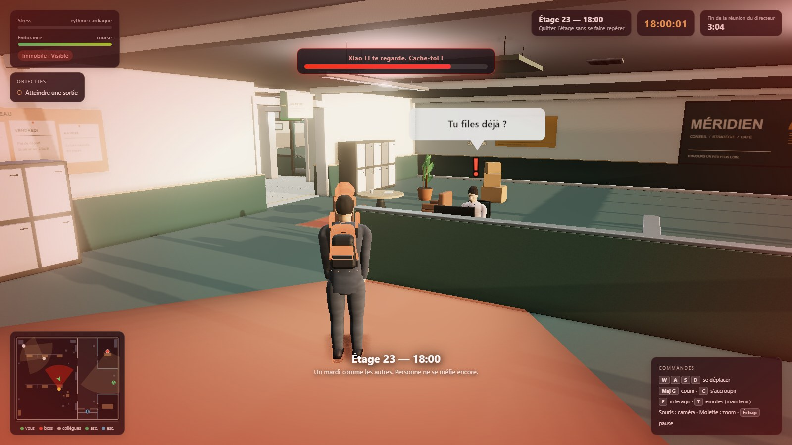<br>
      <sub><b>« Hé ? Tu vas où ? »</b> Xiao Li t'a vu. La jauge monte : disparais avant qu'elle soit pleine.</sub></td>
    <td width="50%">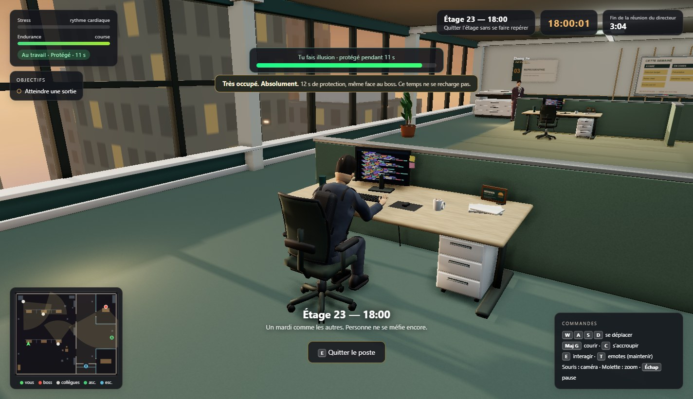<br>
      <sub><b>Très occupé. Absolument.</b> Assieds-toi à un poste libre : 12 secondes d'immunité, même sous le nez du boss.</sub></td>
  </tr>
  <tr>
    <td width="50%">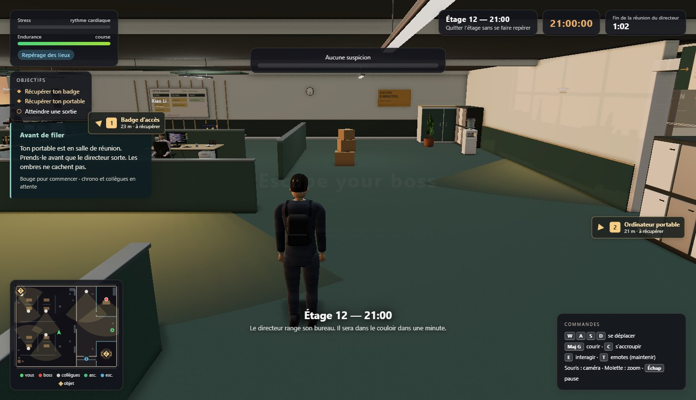<br>
      <sub><b>Étage 12, 21:00.</b> Ton badge et ton portable traînent à l'autre bout de l'étage. La réunion se termine dans 62 secondes.</sub></td>
    <td width="50%">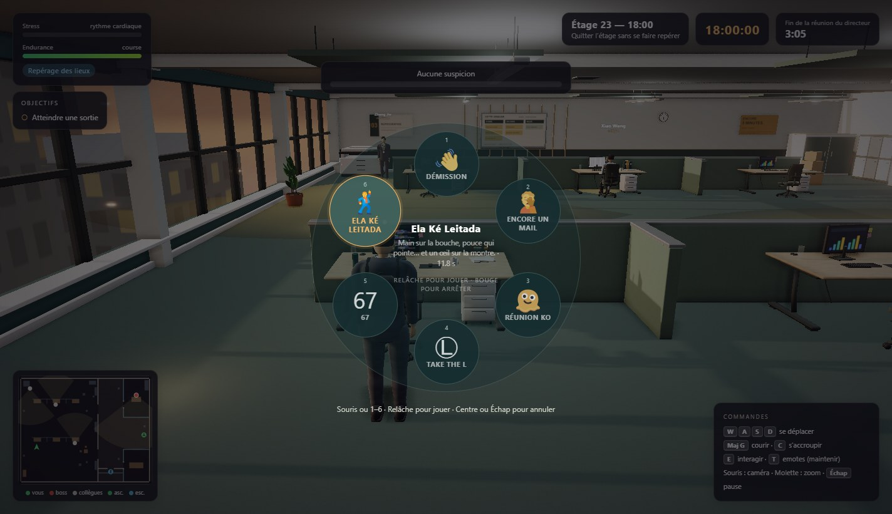<br>
      <sub><b>Six emotes</b>, dont <i>67</i> et <i>Ela Ké Leitada</i>. Tant qu'à partir, autant partir avec style.</sub></td>
  </tr>
</table>

- **Une vraie infiltration.** Les collègues ont un champ de vision, une ligne de
  vue et des oreilles. Accroupi, tu passes sous la hauteur des bureaux et des
  cloisons basses. Debout, on te voit par-dessus.
- **Ils te voient venir… et toi aussi.** Chaque collègue passe par quatre états :
  il travaille, il **doute** (« ? »), il **t'observe** (« ! », cône rouge), puis
  il te **repère**. Tu as toujours une chance de te cacher avant la fin.
- **Des outils de bureau.** La photocopieuse fait diversion, un poste libre te
  sert d'alibi, et le verre de la salle de réunion laisse passer les regards.
- **Un compte à rebours.** À la fin de la réunion, le directeur sort de son
  bureau et part à ta recherche. Le jeu continue, mais en beaucoup plus dur.
- **Deux sorties, deux risques.** L'ascenseur est tout près, mais collé à la
  cage vitrée du directeur, et il faut y rester immobile trois secondes.
  L'escalier démarre tout de suite, mais le trajet est deux fois plus long et
  traverse le couloir du vigile.
- **Un bureau qui a de l'humour.** Affiches internes, trophée de l'employé du
  mois décerné à la machine à café, sablier de « réunion express », tampon
  « départ à l'heure » en attente de validation depuis 18 h…

<table>
  <tr>
    <td width="33%">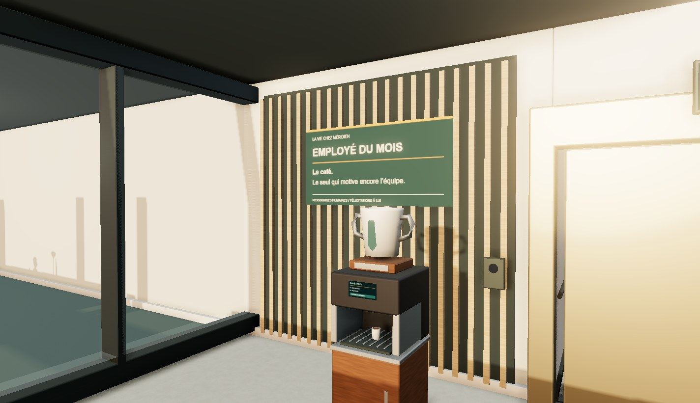</td>
    <td width="33%">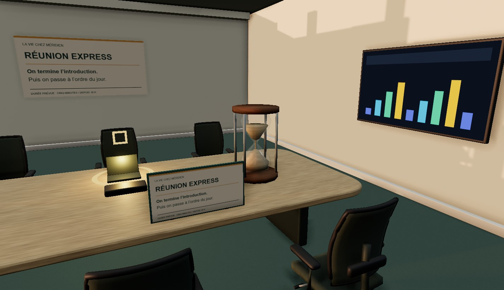</td>
    <td width="33%">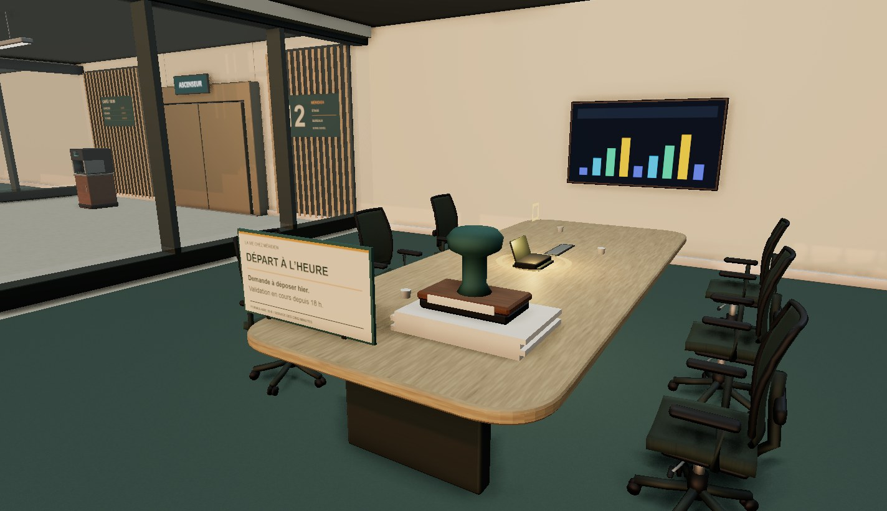</td>
  </tr>
</table>

---

## Six étages, un seul objectif : sortir

| # | Étage | Ce qui change |
|---|---|---|
| 1 | **23 — 18:00** | Un mardi comme les autres. Personne ne se méfie encore : parfait pour apprendre. |
| 2 | **23 — 18:20** | Tu as laissé ton badge près de la photocopieuse, et un vigile fait sa ronde. |
| 3 | **19 — 18:45** | Nouveau plan. Escaliers condamnés pour travaux : il ne reste que l'ascenseur. |
| 4 | **19 — 19:30** | La moitié des néons sont coupés. Ton portable est en salle de réunion. |
| 5 | **12 — 20:15** | Box serrés, allées étroites, six collègues. On se croise vite, ici. |
| 6 | **12 — 21:00** | Deux objets à récupérer. La réunion se termine dans 62 secondes. |

<p align="center">
  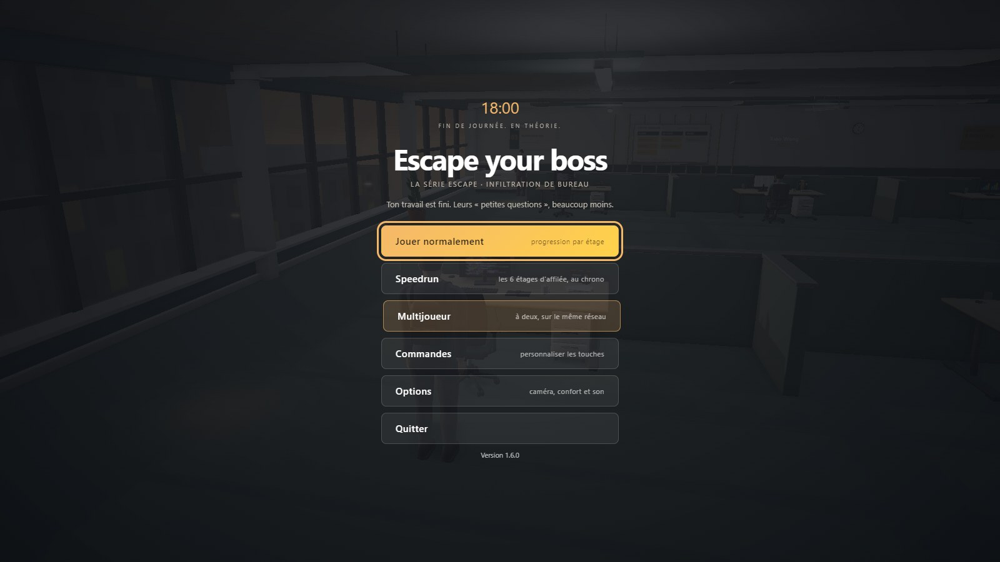
</p>

- **Jouer normalement** : chaque étage terminé débloque le suivant et garde ton
  meilleur temps.
- **Speedrun** : les six étages d'affilée, chrono cumulé et temps intermédiaires.
  Un échec ne remet pas le chrono à zéro : il te coûte le temps de recommencer
  l'étage.
- **Multijoueur** : les six étages en coopération, à deux.

---

## Joue à deux

<p align="center">
  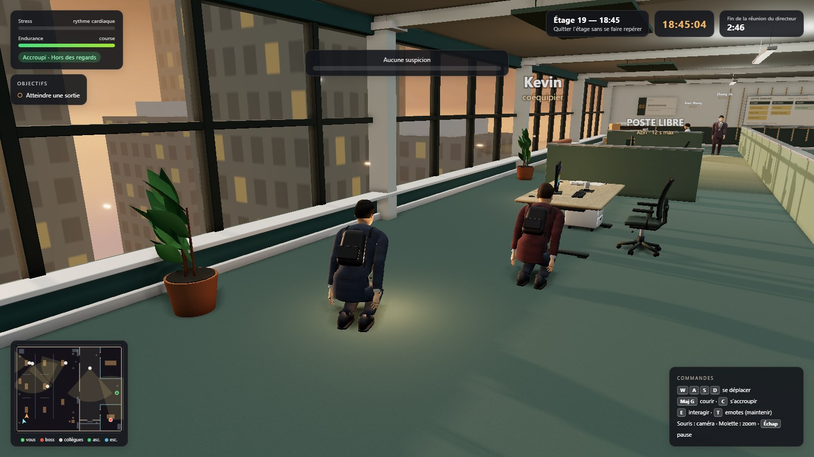
</p>

Depuis la version 1.6.0, tu peux t'évader **avec un ami, sur le même réseau**
(même Wi-Fi ou même box). Pas de serveur ni de compte à créer.

1. Vous téléchargez tous les deux **la même version** du jeu.
2. L'un choisit **Multijoueur → Héberger une partie**. La première fois, Windows
   demande l'accès au réseau : coche **Réseaux privés** et accepte.
3. L'autre choisit **Multijoueur → Rechercher une partie** et clique sur la
   partie trouvée. Si rien n'apparaît, il peut taper l'adresse IP affichée chez
   l'hôte.
4. L'hôte choisit l'étage et lance. Ton coéquipier porte une veste bordeaux et
   son nom flotte au-dessus de sa tête.

**Les règles sont simples :** si l'un de vous se fait repérer, vous retournez
tous les deux à votre poste. L'étage est gagné quand vous êtes sortis tous les
deux. Les objets à récupérer sont communs, et la photocopieuse, les postes et les
emotes marchent pour chacun.

Ça ne se connecte pas ? Le [guide multijoueur](docs/MULTIJOUEUR.md) détaille le
pare-feu, les ports et les messages d'erreur.

---

## Commandes

Toutes les touches se changent dans **Menu → Commandes**. Le jeu lit la position
physique des touches : sur un clavier AZERTY, **ZQSD** fonctionne sans rien
toucher.

| Touche | Action |
|---|---|
| `W` `A` `S` `D` (`Z` `Q` `S` `D` en AZERTY) | se déplacer |
| `Shift` | courir : rapide, mais bruyant, et ça fait monter le stress |
| `Ctrl` (maintenir) ou `C` (bascule) | s'accroupir |
| `E` | interagir : sorties, photocopieuse, s'asseoir à un poste ou le quitter |
| `T` (maintenir) | roue d'emotes : choisis à la souris ou avec `1`–`6`, relâche pour jouer |
| Souris · molette | caméra · zoom |
| `V` · `B` | afficher/masquer les cônes de vision · les noms des collègues |
| `M` · `R` · `Échap` | couper le son · recommencer · pause |
| `F11` | plein écran |

---

## Petit guide de survie en open space

- **Prends ton temps au départ.** Le chrono et les collègues attendent ton
  premier pas : lis les objectifs et regarde autour de toi. L'étage 1 propose une
  prise en main facultative.
- **Baisse-toi.** Accroupi, tu disparais derrière les bureaux (0,75 m) et les
  cloisons basses (1,15 m). Les ombres, elles, ne te cachent pas.
- **Méfie-toi du verre.** Le bureau du directeur et la salle de réunion
  bloquent le passage, pas le regard.
- **Ne cours pas n'importe où.** Courir s'entend à 5 m à travers les murs,
  marcher à 3 m, avancer accroupi à 1,4 m. Si ton stress sature, tu reprends ton
  souffle bruyamment et tout le monde sursaute à 7 m.
- **Utilise la photocopieuse.** `E` à côté lance une diversion de 6 secondes, une
  fois par étage : les collègues à moins de 12 m tournent la tête.
- **Fais semblant de travailler.** Deux postes libres par étage, 12 secondes de
  protection chacun, qui ne se rechargent pas. Une jauge te prévient à 3 secondes
  de la fin.
- **Choisis ta sortie.** Ascenseur rapide mais exposé, ou escalier long mais
  discret : à chaque étage, le bon choix change.

Tes progrès, tes records, tes touches et tes options sont sauvegardés dans
`%APPDATA%\EscapeYourBoss\progression.json`.

---

## Pour les curieux et les développeurs

Le jeu est écrit en JavaScript avec **Three.js** (sans moteur de jeu ni moteur
physique) et distribué avec **Electron**. Les personnages, le mobilier et les
accessoires sont modélisés dans **Blender** ; une grande partie des textures est
générée au lancement.

Pour le lancer depuis les sources (Node.js 20 ou plus récent) :

```bash
git clone https://github.com/SoLeQz/EscapeYourBoss.git
cd EscapeYourBoss
npm install
npm start              # lance le jeu en développement
npm run build:win      # -> dist/EscapeYourBoss-win32-x64/EscapeYourBoss.exe
npm run build:linux    # variante Linux, à compiler soi-même
```

- [Notes techniques](docs/TECHNIQUE.md) : game feel, détection, rendu,
  performances, tests automatisés et journal des versions.
- [Guide multijoueur](docs/MULTIJOUEUR.md) : réseau, dépannage et publication.
- [Créer ses propres personnages](docs/CREER_DES_PERSONNAGES.md) avec Blender
  ou Unreal Engine 5.

---

<p align="center">
  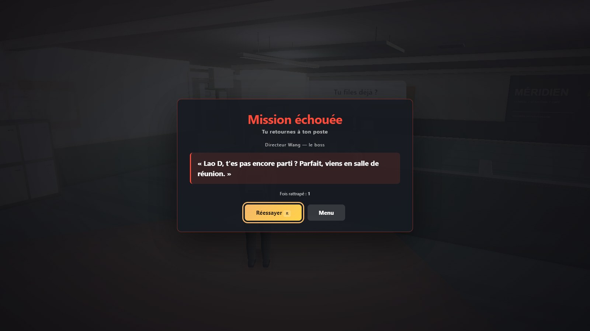<br>
  <sub>Ne laisse pas ça t'arriver. <a href="https://github.com/SoLeQz/EscapeYourBoss/releases/latest"><b>Télécharge le jeu</b></a> et rentre chez toi à l'heure.</sub>
</p>

<p align="center"><sub>Un jeu de <a href="https://github.com/SoLeQz">SoLeQz</a>.</sub></p>
