<h1 align="center">Escape your boss</h1>

<p align="center">
  <b>Il est 18:00. Ton travail est fini. Ton sac est prêt.</b><br>
  Entre toi et l'ascenseur : dix étages, des collègues qui ont toujours
  « une petite question »,<br>et un directeur qui adore les réunions de
  « juste cinq minutes ».
</p>

<p align="center">
  <a href="https://github.com/SoLeQz/EscapeYourBoss/releases/latest">
    
  </a>
</p>

<p align="center">
  
  
  
  
  
</p>

<p align="center">
  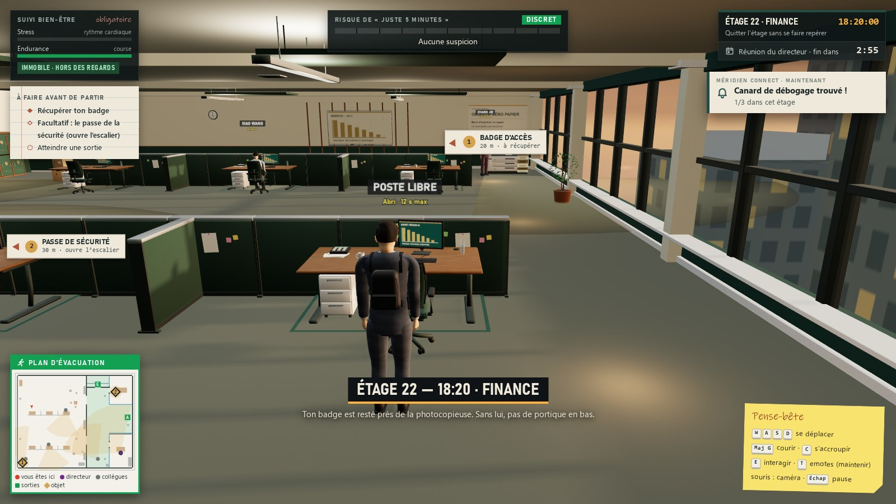
</p>

**Escape your boss** est un jeu d'infiltration humoristique en 3D. Tu incarnes
**Lao D**, développeur chez Méridien (*Conseil · Stratégie · Café*), et ta seule
mission est de **quitter le bureau à l'heure**. Faufile-toi derrière les
cloisons, fais semblant de travailler quand un regard se pose sur toi, lance la
photocopieuse pour détourner l'attention… et file avant la fin de la réunion du
directeur.

Dix étages, dix services, trente canards de débogage cachés, des passages
secrets, un vestiaire plein d'accessoires absurdes et jusqu'à trois collègues
pour s'enfuir avec toi. Premier volet de la série **Escape…**

---

## Télécharger et jouer

1. Va sur la **[page des versions](https://github.com/SoLeQz/EscapeYourBoss/releases/latest)**
   et télécharge `EscapeYourBoss-<version>-win64.zip` (≈ 120 Mo).
2. **Dézippe** le dossier où tu veux (bureau, `Documents`, clé USB…).
3. Double-clique sur **`EscapeYourBoss.exe`**. C'est tout : rien à installer.

> **Windows affiche « Windows a protégé votre ordinateur » ?**
> Le jeu n'est pas signé numériquement (ça coûte cher pour un projet perso).
> Clique sur **Informations complémentaires** puis **Exécuter quand même**.

| | Configuration |
|---|---|
| **Système** | Windows 10 ou 11, 64 bits |
| **Carte graphique** | dédiée conseillée ; un GPU intégré fonctionne, avec des effets allégés |
| **Espace disque** | ≈ 300 Mo une fois dézippé |
| **Contrôles** | clavier + souris (ZQSD en AZERTY sans rien régler) |

Le jeu détecte ta carte graphique au lancement et règle la qualité tout seul.
Sur un portable à deux GPU, il réclame la carte dédiée. Tes sauvegardes sont
conservées d'une version à l'autre.

---

## Bienvenue sur Méridien Connect

Le menu n'est pas un menu : c'est **l'intranet de l'agence**. Une sortie de
secours lumineuse en guise de logo, ton badge collaborateur, les notifications
du directeur (« RE: RE: RE: Point rapide »), des indicateurs de performance
calculés sur ta vraie progression… et une horloge bloquée à 17:59.

<p align="center">
  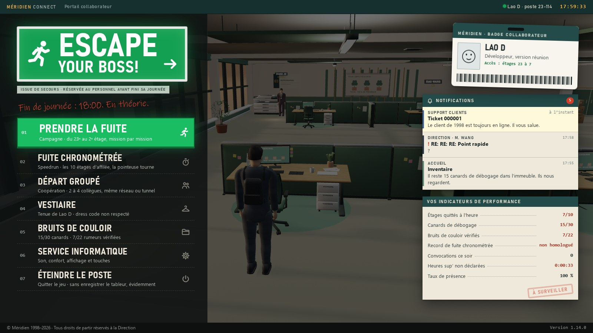
</p>

<table>
  <tr>
    <td width="50%">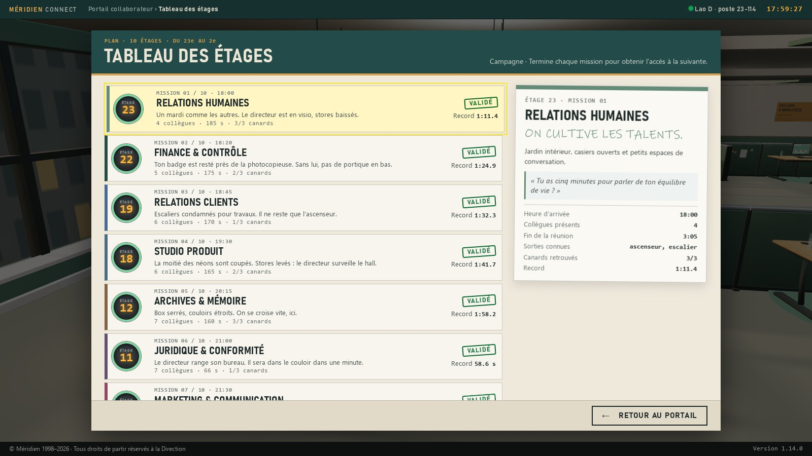<br>
      <sub><b>Tableau des étages.</b> Dix missions, du 23<sup>e</sup> au 2<sup>e</sup>, avec tes records et les canards retrouvés.</sub></td>
    <td width="50%">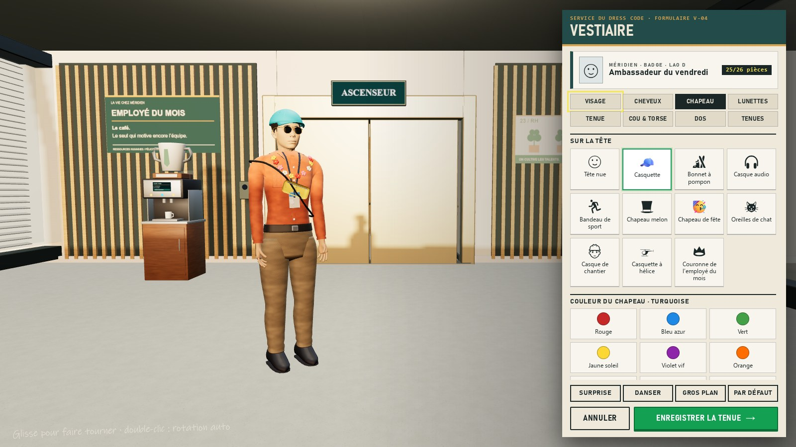<br>
      <sub><b>Vestiaire.</b> Tenue « Ambassadeur du vendredi » validée par le service du dress code. Plus ou moins.</sub></td>
  </tr>
  <tr>
    <td width="50%">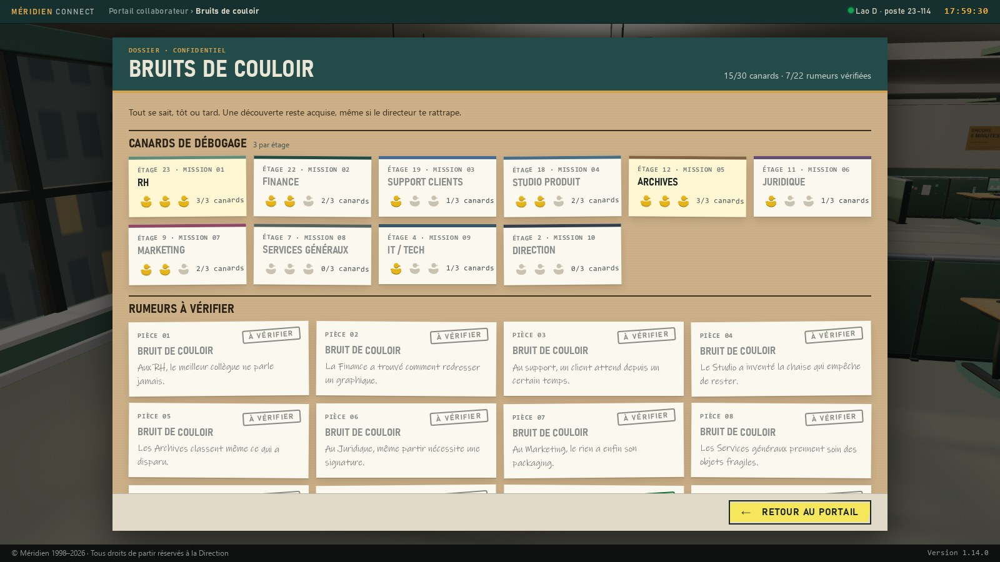<br>
      <sub><b>Bruits de couloir.</b> 30 canards de débogage et 22 rumeurs à vérifier. Ce qui est trouvé reste trouvé, même après un échec.</sub></td>
    <td width="50%">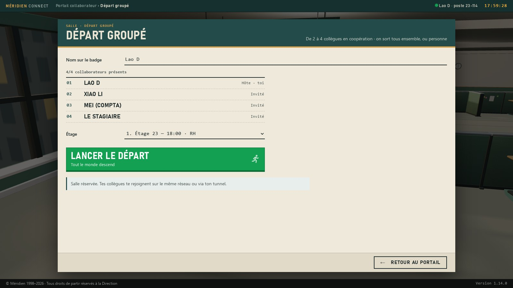<br>
      <sub><b>Départ groupé.</b> Jusqu'à quatre collègues sur le même réseau. On sort tous ensemble, ou personne.</sub></td>
  </tr>
</table>

---

## Ce qui t'attend

<table>
  <tr>
    <td width="50%">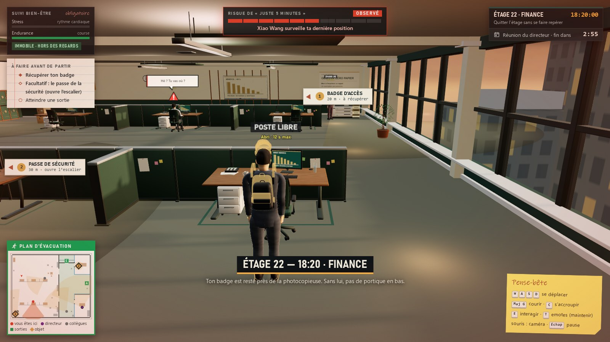<br>
      <sub><b>« Hé ? Tu vas où ? »</b> Xiao Wang t'a vu. La jauge « Risque de juste 5 minutes » grimpe : disparais avant qu'elle soit pleine.</sub></td>
    <td width="50%">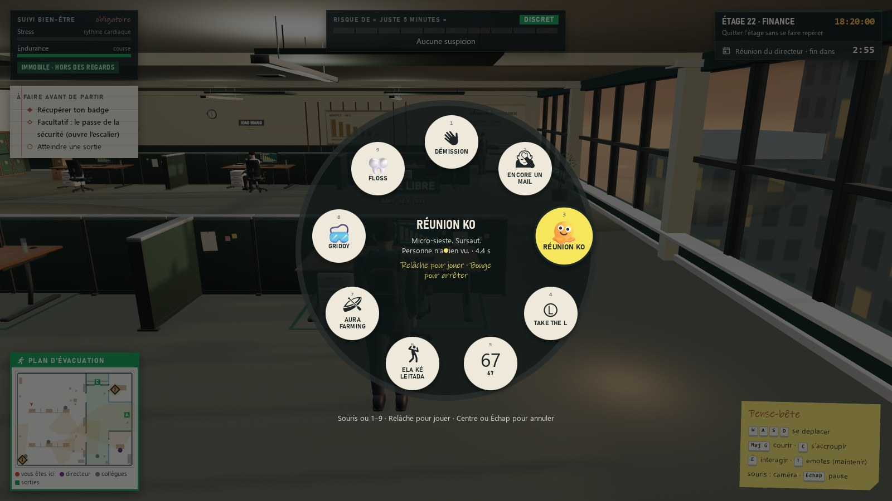<br>
      <sub><b>Neuf emotes</b> animées dans Blender : <i>Démission</i>, <i>Réunion KO</i>, <i>67</i>, <i>Aura Farming</i>, <i>Griddy</i>, <i>Floss</i>… Tant qu'à partir, autant partir avec style.</sub></td>
  </tr>
  <tr>
    <td width="50%">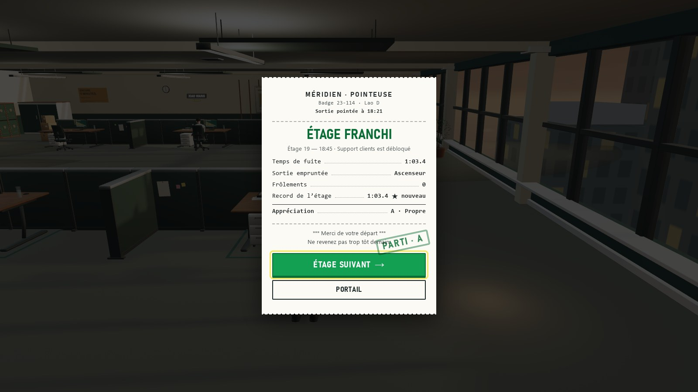<br>
      <sub><b>Sortie pointée à 18:21.</b> Chaque étage réussi te vaut un ticket de pointeuse. « Ne revenez pas trop tôt demain. »</sub></td>
    <td width="50%">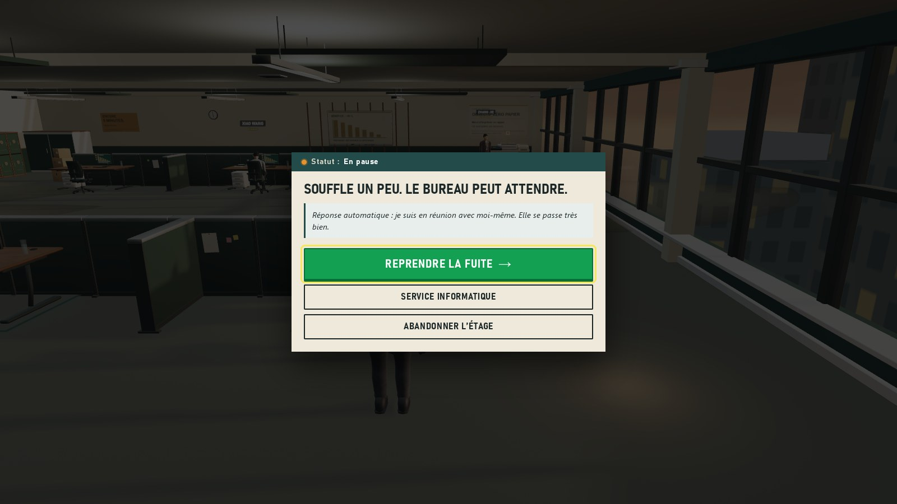<br>
      <sub><b>Statut : en pause.</b> « Réponse automatique : je suis en réunion avec moi-même. Elle se passe très bien. »</sub></td>
  </tr>
</table>

- **Une vraie infiltration.** Les collègues ont un champ de vision, une ligne de
  vue et des oreilles. Accroupi, tu passes sous la hauteur des bureaux et des
  cloisons basses. Debout, on te voit par-dessus.
- **Ils te voient venir… et toi aussi.** Chaque collègue passe par quatre états :
  il travaille, il **doute** (« ? »), il **t'observe** (« ! », cône rouge), puis
  il te **repère**. Tu as toujours une chance de te cacher avant la fin.
- **Des outils de bureau.** La photocopieuse fait diversion, un poste libre te
  sert d'alibi, le carton te cache (sans te rendre invincible), le disjoncteur
  plonge l'étage dans le noir 14 secondes, et le verre de la salle de réunion
  laisse passer les regards.
- **Un compte à rebours.** À la fin de la réunion, le directeur sort de son
  bureau et part à ta recherche. Le jeu continue, mais en beaucoup plus dur.
- **Plusieurs façons de sortir.** L'ascenseur est tout près du bureau vitré du
  directeur et il faut y rester immobile trois secondes. L'escalier est plus long
  et traverse le couloir du vigile. Et certains étages cachent une nacelle de
  laveur de vitres, une bibliothèque pivotante ou une sortie secrète.
- **Un bureau qui a de l'humour.** Le ficus employé du mois, le dossier 404, la
  campagne RIEN™ « désormais en format familial », le serveur au vert parce qu'on a
  retiré ses voyants rouges, le trophée « Parti à l'heure » jamais attribué…
- **Un vestiaire.** Quatre visages, teint, cheveux, chemise, veste, pantalon et
  une vingtaine d'accessoires modélisés dans Blender : casquette, chapeau melon,
  oreilles de chat, lunettes aviateur, moustache guidon, collier de fleurs…
  Certains se gagnent en jouant : gilet fluo, casquette à hélice, jetpack,
  couronne de l'employé du mois, cape du speedrun. Tes coéquipiers te voient
  comme tu t'es habillé, et les collègues ne se privent pas de commenter.

---

## Dix étages, dix services

Chaque étage a son département, sa palette, son mobilier et ses collègues qui
parlent boutique. Le tableau ci-dessous suit l'ordre de la descente.

<table>
  <tr>
    <td width="33%">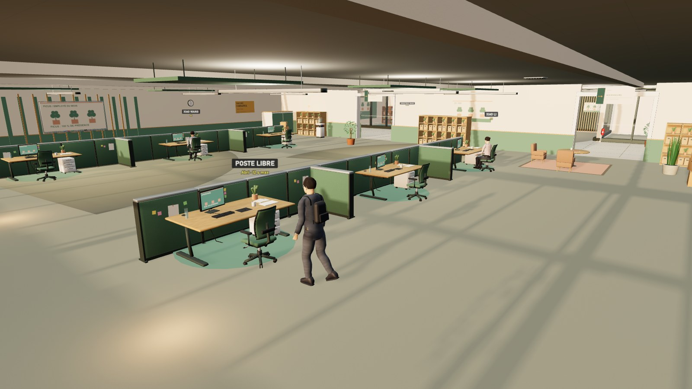<br>
      <sub><b>23 · RH.</b> Sauge, casiers à paniers et plantes. Le ficus est employé du mois.</sub></td>
    <td width="33%">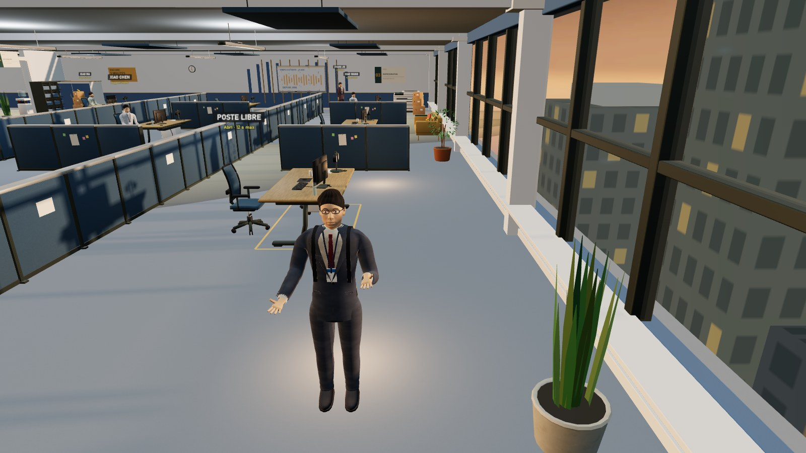<br>
      <sub><b>19 · Support clients.</b> Bleu ardoise, casques et escaliers condamnés.</sub></td>
    <td width="33%">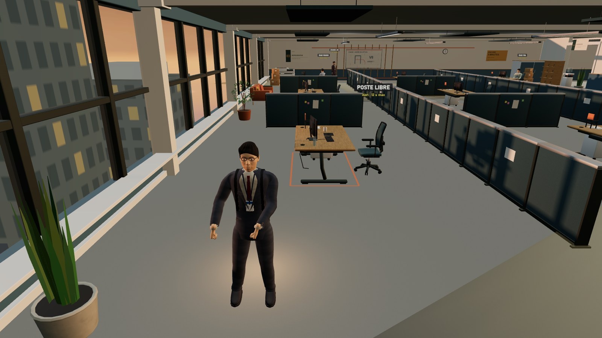<br>
      <sub><b>18 · Studio produit.</b> Chaise version finale 8. L'assise reste à l'étude.</sub></td>
  </tr>
  <tr>
    <td width="33%">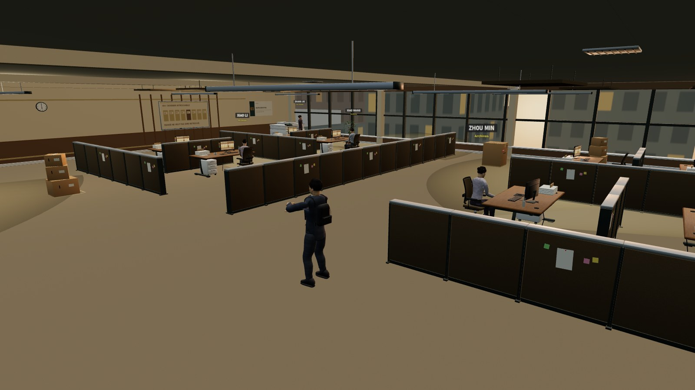<br>
      <sub><b>12 · Archives.</b> Tabac, kraft et box serrés. On se croise vite, ici.</sub></td>
    <td width="33%">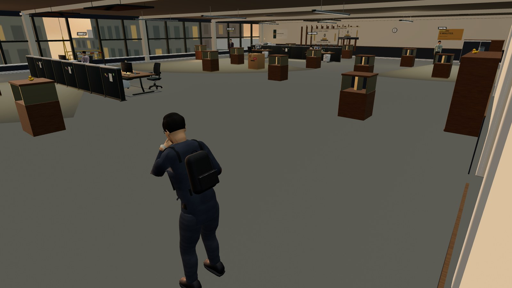<br>
      <sub><b>2 · Direction.</b> Vitrines, trophées et dernier départ de la soirée.</sub></td>
    <td width="33%">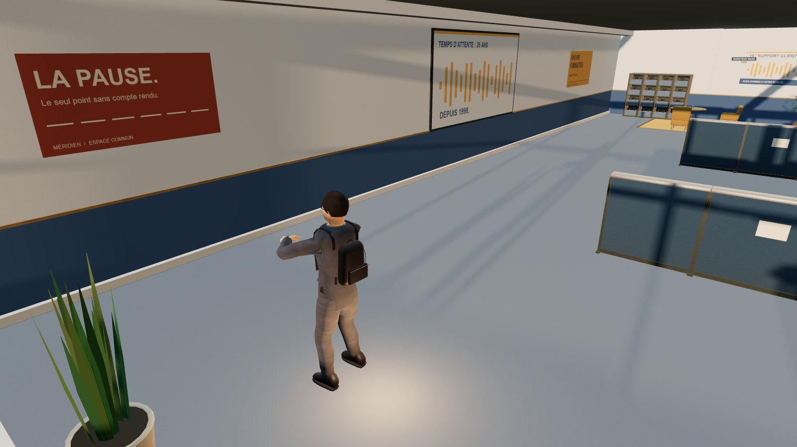<br>
      <sub><b>Temps d'attente : 28 ans.</b> Le client de 1998 est toujours en ligne. Il vous salue.</sub></td>
  </tr>
</table>

| # | Étage | Service | Ce qui t'attend |
|---|---|---|---|
| 1 | **23 — 18:00** | Relations humaines | Un mardi comme les autres. Le directeur est en visio, stores baissés. |
| 2 | **22 — 18:20** | Finance & contrôle | Ton badge est resté près de la photocopieuse, et un vigile fait sa ronde. |
| 3 | **19 — 18:45** | Relations clients | Escaliers condamnés pour travaux : il ne reste que l'ascenseur. |
| 4 | **18 — 19:30** | Studio produit | La moitié des néons sont coupés. Ton portable est en salle de réunion. |
| 5 | **12 — 20:15** | Archives & mémoire | Box serrés, couloirs étroits, sept collègues. |
| 6 | **11 — 21:00** | Juridique & conformité | Deux objets à récupérer. La réunion se termine dans 66 secondes. |
| 7 | **9 — 21:30** | Marketing & communication | Afterwork, îlots ronds… et une bibliothèque un peu suspecte. |
| 8 | **7 — 22:00** | Services généraux | Déménagement : trouve la clé du laveur de vitres pour emprunter sa nacelle. |
| 9 | **4 — 22:40** | Systèmes & informatique | Avez-vous essayé de l'éteindre et de le rallumer ? |
| 10 | **2 — 23:15** | Présidence & direction | Dernier étage. Le directeur finit sa réunion dans une minute et quart. |

- **Prendre la fuite** (campagne) : chaque étage terminé débloque le suivant et
  garde ton meilleur temps.
- **Fuite chronométrée** (speedrun) : les dix étages d'affilée, chrono cumulé et
  temps intermédiaires. Un échec ne remet pas le chrono à zéro : il te coûte le
  temps de recommencer l'étage.
- **Départ groupé** : les dix étages en coopération, de 2 à 4 joueurs.

---

## Joue à deux, trois ou quatre

Un hôte peut accueillir **jusqu'à trois amis**. Chacun garde sa tenue du
vestiaire, son nom sur le badge et sa place dans le groupe.

1. Tous les joueurs utilisent **la même version** du jeu.
2. L'un choisit **Départ groupé → Réserver une salle** : c'est l'hôte.
3. Les autres choisissent **Chercher une réunion**, ou saisissent l'adresse de l'hôte.
4. Le salon affiche les noms et le nombre de places occupées. L'hôte choisit
   l'étage et lance quand le groupe est réuni. Le départ attend tous les chargements.

Un joueur repéré fait perdre tout le groupe. Les objectifs et les découvertes sont
partagés, mais **chacun doit rejoindre une sortie pour gagner**. Les cachettes,
postes, tenues et emotes fonctionnent individuellement. Échap ouvre uniquement le
menu local : la partie continue pour les autres.

On rejoint une partie **depuis le salon**, avant le lancement. Si quelqu'un quitte
un étage, le groupe revient au salon ; l'hôte peut relancer avec les joueurs restants.
Pour jouer à distance via un tunnel TCP, chaque invité utilise la même adresse
publique `hôte:port`. Le [guide multijoueur](docs/MULTIJOUEUR.md) explique tout.

---

## Commandes

Toutes les touches se changent dans **Service informatique → Clavier & souris**. Le jeu
lit la position physique des touches : sur un clavier AZERTY, **ZQSD** fonctionne
sans rien toucher.

| Touche | Action |
|---|---|
| `W` `A` `S` `D` (`Z` `Q` `S` `D` en AZERTY) | se déplacer |
| `Shift` | courir : rapide, mais bruyant, et ça fait monter le stress |
| `Ctrl` (maintenir) ou `C` (bascule) | s'accroupir |
| `E` | interagir : sorties, photocopieuse, postes, cartons, tableaux à examiner… |
| `T` (maintenir) | roue d'emotes : choisis à la souris ou avec `1`–`9`, relâche pour jouer |
| Souris · molette | caméra · zoom |
| `V` · `B` | afficher/masquer les cônes de vision · les noms des collègues |
| `M` · `R` · `Échap` | couper le son · recommencer · pause |
| `F11` | plein écran |

---

## Petit guide de survie en open space

- **Prends ton temps au départ.** Le chrono et les collègues attendent ton
  premier pas : lis les objectifs et regarde autour de toi. L'étage 23 propose une
  prise en main facultative.
- **Baisse-toi.** Accroupi, tu disparais derrière les bureaux (0,75 m) et les
  cloisons basses (1,15 m). Les ombres, elles, ne te cachent pas.
- **Méfie-toi du verre.** Le bureau du directeur et la salle de réunion
  bloquent le passage, pas le regard.
- **Ne cours pas n'importe où.** Courir s'entend à 5 m à travers les murs,
  marcher à 3 m, avancer accroupi à 1,4 m. Si ton stress sature, tu reprends ton
  souffle bruyamment et tout le monde sursaute à 7 m.
- **Utilise la photocopieuse.** `E` à côté lance une diversion de 6 secondes, une
  fois par étage : les collègues à moins de 12 m tournent la tête.
- **Fais semblant de travailler.** Deux postes libres par étage, 12 secondes de
  protection chacun, qui ne se rechargent pas. Une jauge te prévient à 3 secondes
  de la fin.
- **Fouille.** Les canards de débogage, les rumeurs et les passages secrets
  restent acquis même si le directeur te rattrape. Bellek !

Tes progrès, tes records, tes touches et tes options sont sauvegardés dans
`%APPDATA%\EscapeYourBoss\progression.json`.

---

## Pour les curieux et les développeurs

Le jeu est écrit en JavaScript avec **Three.js** (sans moteur de jeu ni moteur
physique) et distribué avec **Electron**. Les personnages, le mobilier, les
accessoires et les emotes sont modélisés et animés dans **Blender** ; une grande
partie des textures est générée au lancement.

Pour le lancer depuis les sources (Node.js 20 ou plus récent) :

```bash
git clone https://github.com/SoLeQz/EscapeYourBoss.git
cd EscapeYourBoss
npm install
npm start              # lance le jeu en développement
npm run build:win      # -> dist/EscapeYourBoss-win32-x64/EscapeYourBoss.exe
npm run build:linux    # variante Linux, à compiler soi-même
```

- [Notes techniques](docs/TECHNIQUE.md) : game feel, détection, rendu,
  performances, tests automatisés et journal des versions.
- [Guide multijoueur](docs/MULTIJOUEUR.md) : réseau, dépannage et publication.
- [Les dix départements](docs/art/DEPARTEMENTS.md) : palettes, mobilier Blender,
  découvertes et contraintes de jeu.
- [Emotes et sons](docs/EMOTES_ET_REFERENCES.md) : références et disponibilité
  des pistes.
- [Créer ses propres personnages](docs/CREER_DES_PERSONNAGES.md) avec Blender
  ou Unreal Engine 5.

---

<p align="center">
  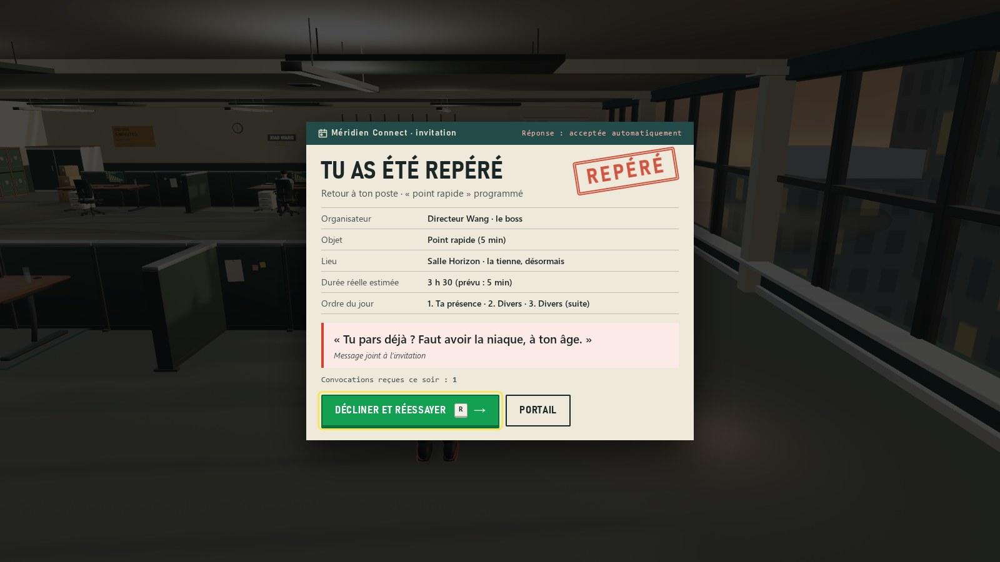<br>
  <sub>Durée réelle estimée : 3 h 30. Ne laisse pas ça t'arriver.<br>
  <a href="https://github.com/SoLeQz/EscapeYourBoss/releases/latest"><b>Télécharge le jeu</b></a> et rentre chez toi à l'heure.</sub>
</p>

<p align="center"><sub>Un jeu de <a href="https://github.com/SoLeQz">SoLeQz</a>.</sub></p>
