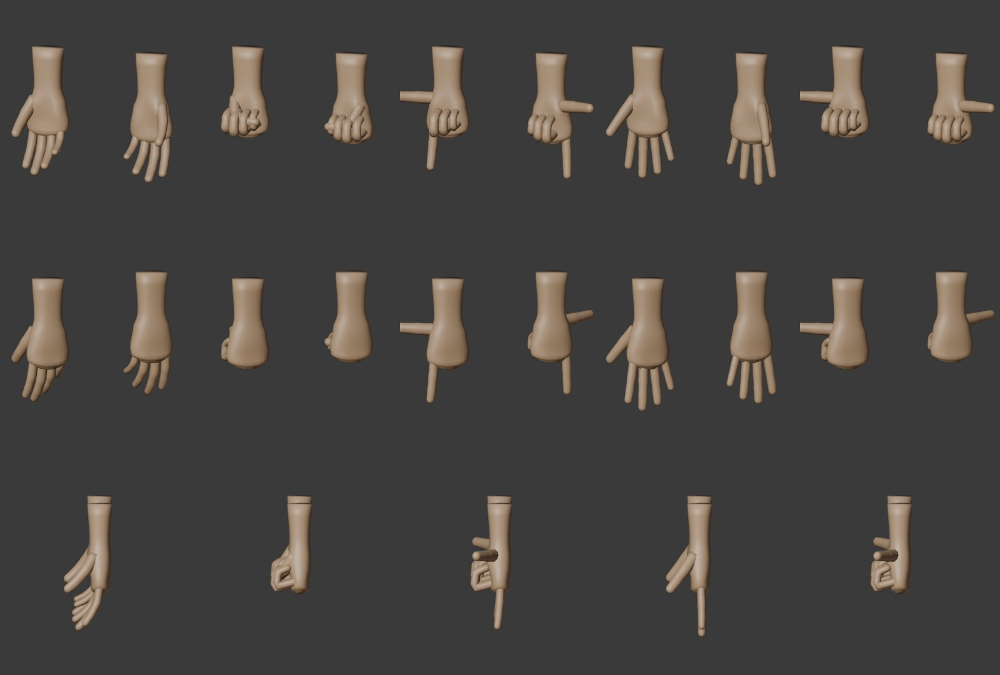

# Mains v02 — Blender

Remplacent `anatomie-v01/mains-v01` pour le joueur et tous les collègues.
Source : [`mains-v02.blend`](mains-v02.blend) · export `assets/mains-v02.glb` ·
générées par `tools/blender/creer_anatomie.py --only mains --version v02` (`hands_v2`).

Planche : de face (paumes), de dos et de profil. Poses repos, Poing, Index, Ouvert, Pouce.
[Gros plan du poing et du pouce levé](poing.jpg).

## Ce qui n'allait pas en v01

**Les mains étaient inversées.** La main modélisée « gauche » était montée sur le bras
droit, et inversement. Au repos, paumes vers l'avant, les pouces pointaient vers le
ventre : aucun bras humain ne peut faire ça. Mesuré dans le jeu : pouce de `mainR`
à −3,9 cm du côté du ventre. En v02, le pouce est **latéral** quand la paume regarde +Z.

S'y ajoutaient un modèle primitif (long tube de poignet, paume plate, doigts raides
et pointus, pouce en bloc) et un morph *Poing* qui ne faisait qu'une légère flexion.

## v02

- Paume creusée, éminences thénar et hypothénar, jointures en arc et en relief,
  bas de paume arrondi dans lequel les doigts s'enfoncent (plus d'encoche).
- Doigts à trois phalanges de longueurs naturelles (index 6,8 · majeur 7,7 ·
  annulaire 7,2 · auriculaire 5,7 cm), bouts arrondis, ongles, plis en relief.
  Au repos, flexion croissante de l'index vers l'auriculaire, comme une main détendue.
- Pouce à trois segments, coussinet tourné vers les doigts, avec ses propres poses.
- Poses (morphs), pilotées par `main[LR]_<Pose>` :
  - **Poing** : vrai poing fermé, pouce couché sur l'index et le majeur ;
  - **Index** : index tendu, pouce sorti (forme de L) ;
  - **Ouvert** : doigts écartés ;
  - **Pouce** (nouveau) : poing fermé, pouce levé.
- 5 688 triangles pour les deux mains. Le budget de 38 000 par personnage est tenu.

Axes **inchangés** : doigts vers −Y, paume +Z local, pivots poignet / doigts
(0, −0,056, 0) / base du pouce. Les emotes gardent le même sens pour « paume vers le haut ».

## Repos naturel des poignets (jeu)

À rotation nulle, la paume regarde devant : c'est la référence des gestes.
`POIGNET_REPOS = 1.0` (`src/emotes.js`) tourne les poignets vers les cuisses pour le
joueur, les collègues, les emotes et le Blender des tendances (`REST`, v04).
`POIGNET_CLAVIER = 2.9` : paumes vers le bas pendant la frappe. Avant, le joueur
tapait paumes vers le haut, défaut antérieur aux mains v02 ; les collègues assis
tapaient mains de chant.
