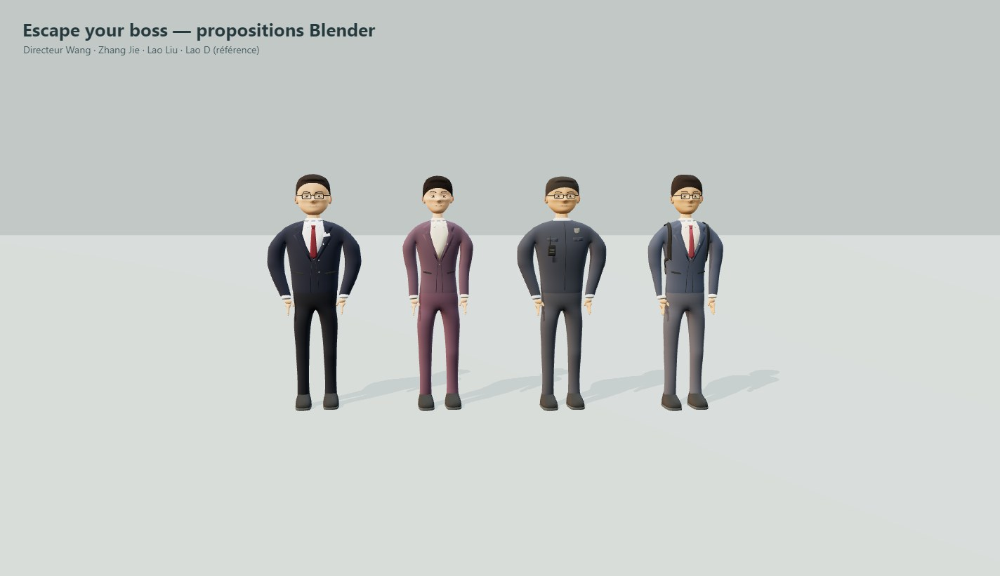

# Propositions Blender des collègues — v01

Captures et rapport produits par **le paquet Windows reconstruit**, dans un
profil Electron temporaire, le 24 septembre 2026. Les empreintes du code et des
GLB correspondent au projet, au paquet et à la copie réellement exécutée :
[paquet-sha256.json](paquet-sha256.json).

| Personnage | Corps | Visage | Assis | Marche |
|---|---|---|---|---|
| Directeur Wang | [Vue](directeur-corps.jpg) | [Vue](directeur-face.jpg) | [Vue](directeur-assis.jpg) | [Vue](directeur-marche.jpg) |
| Zhang Jie | [Vue](zhang-corps.jpg) | [Vue](zhang-face.jpg) | [Vue](zhang-assis.jpg) | [Vue](zhang-marche.jpg) |
| Lao Liu | [Vue](liu-corps.jpg) | [Vue](liu-face.jpg) | [Vue](liu-assis.jpg) | [Vue](liu-marche.jpg) |

Les vues de profil et de dos sont également dans ce dossier. Sur la vue d'ensemble
de dos, l'ordre à l'écran est inversé : Lao D, Lao Liu, Zhang Jie, Directeur Wang.

[Rapport Electron complet](rapport.json) : **4 étapes réussies**, aucune erreur
d'étape ni JavaScript, 20 captures JPEG et une capture de démarrage PNG.
Les avertissements du compilateur de shaders du pilote sont conservés dans le
rapport. Import strict des quatre GLB, sans remplacement de secours.

Pour chacun des trois nouveaux personnages : pose de repos, pose assise,
121 poses échantillonnées sur un cycle de marche, contrôle de sommets finis et
de dimensions plausibles, puis retour au repos. Les captures contrôlent
l'apparence ; les dimensions seules ne détectent pas les défauts de tissu.

Un défaut de poids des manches a été repéré visuellement dans le premier essai :
le bord intérieur restait lié au buste et formait une membrane en pose assise.
Les poids sont maintenant attribués selon les sections de la manche, avant
subdivision. Le contrôle ciblé du bas des manches vérifie **112 / 58 / 90 sommets**
respectivement : influence résiduelle du buste nulle pour ces échantillons.

| Modèle | Triangles | Surfaces skinnées / appels par passe | Matériaux |
|---|---:|---:|---:|
| Directeur Wang | 27 196 | 13 | 13 |
| Zhang Jie | 26 780 | 11 | 11 |
| Lao Liu | 26 376 | 11 | 11 |
| Lao D v03, référence | 29 248 | 11 | 11 |

Ces coûts concernent les modèles seuls, sans les passes d'ombres ni le décor.
Ils ne constituent pas une mesure FPS. Les expressions, clignements, doigts,
poses extrêmes, contours et intégration complète des PNJ restent à réaliser.
Le jeu normal conserve ses personnages procéduraux.

[Sources Blender et commandes de reproduction](../../../docs/blender/GUIDE_COLLEGUES.md).
